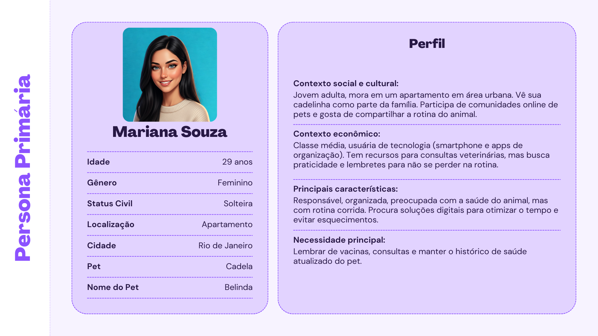
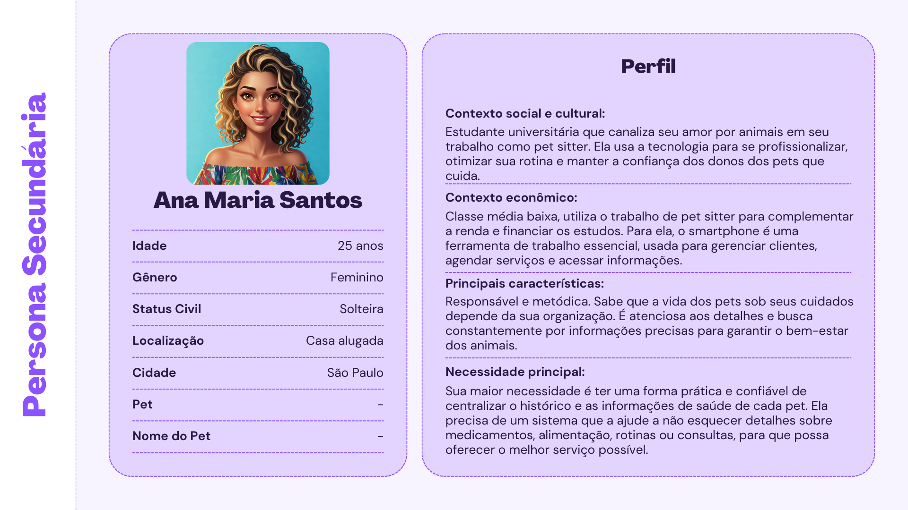
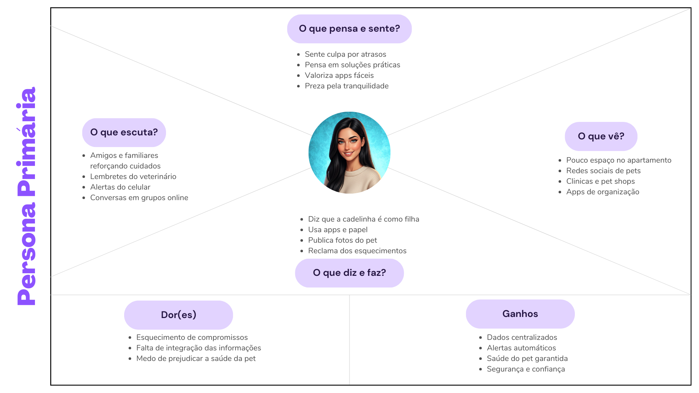
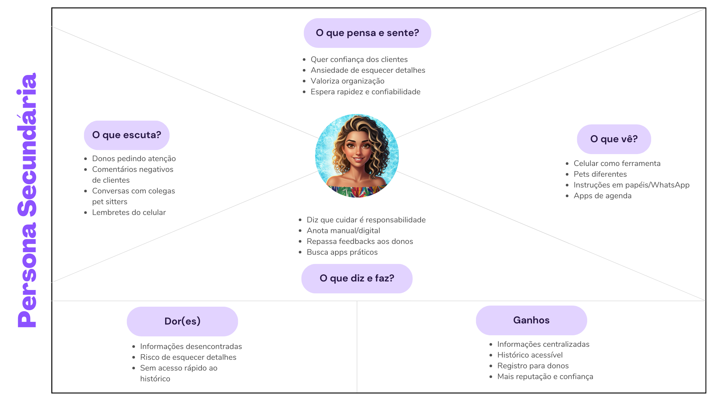
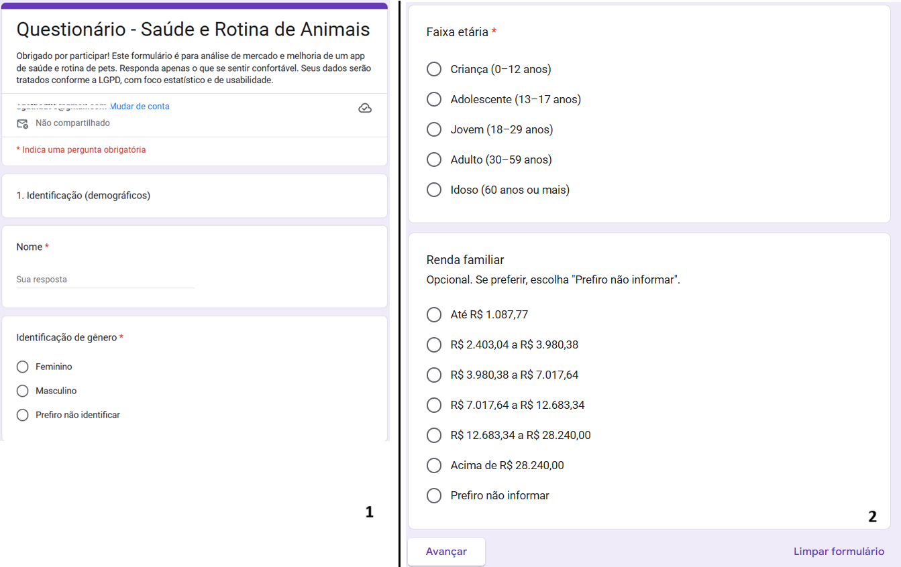

# **Tema escolhido:** Sistema de Monitoramento de Animais de Estimação

Trabalho de Experiencia do Usuário (UX) apresentado ao Centro Universitário [FEI](https://portal.fei.edu.br/), como parte dos requisitos necessários para aprovação na disciplina de Experiência do Usuário e Front-End (CCP310) do curso de Ciencia da Computação, orientado pelo Prof. Dr. [Fagner de Assis Moura Pimentel](https://github.com/fagnerpimentel).

## Componentes do Grupo

- Agatha de Mello Silva

## Resumo

O **PataSegura** é um sistema de monitoramento inteligente para animais de estimação, desenvolvido para auxiliar donos de pets a cuidarem melhor da saúde e da rotina de seus companheiros. A aplicação permite cadastrar usuários e seus animais, registrar vacinas e consultas, configurar lembretes e receber alertas personalizados em um painel intuitivo. Com isso, garante mais organização, bem-estar e tranquilidade para tutores que desejam oferecer o melhor cuidado aos seus pets.

## Introdução
**Contextualização do Problema**: No mundo atual, cada vez mais os animais de estimação são vistos como membros da família. Porém, muitos tutores ainda enfrentam dificuldades para acompanhar a saúde e a rotina de seus pets, como controle de vacinas, consultas, medicamentos e cuidados preventivos. Essa falta de organização pode resultar em riscos à saúde dos animais e em preocupações constantes para os donos. Surge, então, a necessidade de uma solução prática, digital e acessível que ajude a transformar cuidado em tranquilidade.

**Objetivo em Uma Frase**: Levar aos tutores uma plataforma inteligente que simplifica o monitoramento da saúde e do bem-estar dos pets, garantindo mais segurança e qualidade de vida.

**Experiência para o Usuário**: O sistema deve transmitir confiança, praticidade e carinho, funcionando como um “assistente pessoal para pets”. O usuário terá uma experiência intuitiva, com lembretes personalizados e dashboards claros, sentindo-se mais seguro ao cuidar de seu animal e mais próximo dele.

## Publico Alvo
**Perfil Principal**:

🐾 Donos de animais de estimação (cães, gatos e outros pets domésticos).

🐾 Pessoas entre 20 e 50 anos, com rotina ativa e que valorizam tecnologia para facilitar o dia a dia.

🐾 Tutores que enxergam os pets como parte da família e se preocupam com saúde, bem-estar e qualidade de vida dos animais.

### Personas

### Mapa de empatia

## Contexto de uso
#### Ambiente de utilização
O serviço será utilizado principalmente em ambientes digitais (smartphone, tablet e computador). O tutor acessa o aplicativo em casa, no trabalho ou em deslocamentos, sempre que precisar consultar informações de saúde e rotina do pet.

#### Contextos sociais, econômicos e culturais
**Sociais**: Pets vistos como membros da família, alto apego emocional, busca por bem-estar animal.
**Econômicos**: Predominância de classe média (capaz de investir em consultas e vacinas, mas que valoriza soluções práticas e gratuitas ou de baixo custo).
**Culturais**: Crescente digitalização e uso de aplicativos para facilitar o dia a dia (agenda, saúde, delivery, banco). Há também um movimento cultural de valorização da saúde preventiva dos animais.

#### Informações sobre o ambiente que o produto deve guardar
🐾 Preferência de uso do dispositivo (celular, tablet, PC).
🐾 Configuração de idioma e acessibilidade.
🐾 Rotina do usuário (ex.: alertas preferidos de manhã/noite).
🐾 Localização aproximada (para sugerir clínicas ou campanhas de vacinação próximas).

#### O que acontece no ambiente durante a interação
🐾 Usuário acessa o app para cadastrar ou consultar informações do pet.
🐾 Pode estar em contexto de organização diária (em casa, anotando vacinas) ou em situações emergenciais (ex.: lembrar medicação no horário certo).
🐾 Normalmente o ambiente é dinâmico: o usuário está no celular, conciliando com outras tarefas do dia.

## Jornada do usuário

#### Narrativa passo a passo
**Primeiro contato**

Mariana (tutora) encontra o app na loja ou por indicação.
Baixa e instala o aplicativo.

**Cadastro inicial**

Cria perfil (nome, e-mail, senha).
Registra seu pet (nome, espécie, raça, idade, peso, foto).

**Configuração inicial**

Adiciona dados de saúde do pet: vacinas já tomadas, última consulta, medicações.
Define lembretes automáticos (ex.: “próxima vacina em setembro”).

**Uso recorrente**

Recebe notificações de lembrete (“consulta amanhã às 15h”).
Consulta o histórico do pet quando vai ao veterinário.
Atualiza informações após cada visita ou aplicação de vacina.

**Interações secundárias**

Compartilha acesso temporário com a pet sitter (Ana) para cuidar do pet.
Veterinário pode visualizar histórico em PDF enviado pelo tutor.

**Encerramento da tarefa**

Usuário se sente seguro e organizado, com todo o histórico centralizado.
Reforço positivo: sensação de que está cuidando melhor do pet.

## Análise de concorrência
1. Petz App / CObasi (Brasil)
Pontos positivos: Interface amigável; integração com e-commerce (produtos e serviços para pets); agendamento em lojas Petz e/ou Cobasi.
Pontos negativos: Muito focado em vendas, pouco em organização de saúde do pet; funcionalidades restritas a quem consome dentro da rede.

2. Pawtrack / DogLog (internacionais)
Pontos positivos: Controle de passeios, alimentação, comportamentos; integração com GPS em alguns casos.
Pontos negativos: Interface em inglês; pouco foco no acompanhamento médico e vacinas.

3. PetDesk (EUA)
Pontos positivos: Excelente para lembretes de vacinas e consultas; integração com clínicas veterinárias; histórico detalhado.
Pontos negativos: Focado no mercado americano; depende da adesão de clínicas parceiras; pode ser complexo para tutores que só querem algo simples.

**Conclusão da Análise**

Sim, existem plataformas similares (como PetDesk) que atendem a parte do mercado e funcionalidades, mas são muito regionais e complexas.
Plataformas diferentes quanto ao serviço, mas que atendem indiretamente o mercado (como apps de saúde ou agendas digitais) já ajudam na organização, mas não são especializados em pets.
Oportunidade: Criar uma solução simples, intuitiva e focada no acompanhamento da saúde e rotina dos pets, com funcionalidades centrais (alertas, histórico, compartilhamento), sem sobrecarregar o usuário com excesso de recursos ou foco apenas em vendas.

## Coleta de dados
**Objetivo da coleta**
Compreender o perfil dos tutores e cuidadores de animais, identificar suas rotinas, hábitos de organização e principais dificuldades, com o intuito de orientar o desenvolvimento de um aplicativo focado em saúde e bem-estar animal.

[Questionário - Saúde e Rotina de Animais](https://forms.gle/9r8v1772hQCBaGya7) 

**Estrutura das Seções:**
Informações Demográficas: Nome, gênero, faixa etária e renda familiar.
Perfil e Ambiente do Pet: Presença de pet, número, espécie e tipo de ambiente em que vivem.
Saúde e Rotina dos Pets: Status de vacinação, frequência de consultas, uso de medicamentos e tipo de alimentação.
Comportamento do Tutor: Meios utilizados para organização (agenda física, apps, lembretes), experiências com esquecimentos e priorização de funcionalidades em um app.
Perfil do Cuidador (Pet Sitter): Experiência com pets alheios, necessidades informacionais e tais demandas por ferramentas digitais seguras.
Preferências Tecnológicas: Uso anterior de apps pet health, preferências de notificações e dispositivos utilizados.
Consentimento e Privacidade: Garantia de uso conforme LGPD, com explícito consentimento do participante.

## Modelo de tarefas
## Design

- Pense nas características de Affordances do seu serviço ou poduto. 
    - Que tipo de acessibilidades devem ser consideradas dentro do seu projeto?
- Discuta o papel das expectativas do usuário no projeto deste serviço ou poduto. Qual a importância e pontos a serem considerados se você quiser vender esse serviço ou poduto?

### Prototipação em baixo nível (papel)
#### Avaliação heurística

### Prtotipação em médio nível (Figma)
#### Avaliação heurística

### Prtotipação em alto nível (React)
#### Avaliação heurística

<!-- TODOs:
- Add exemplos
 -->

